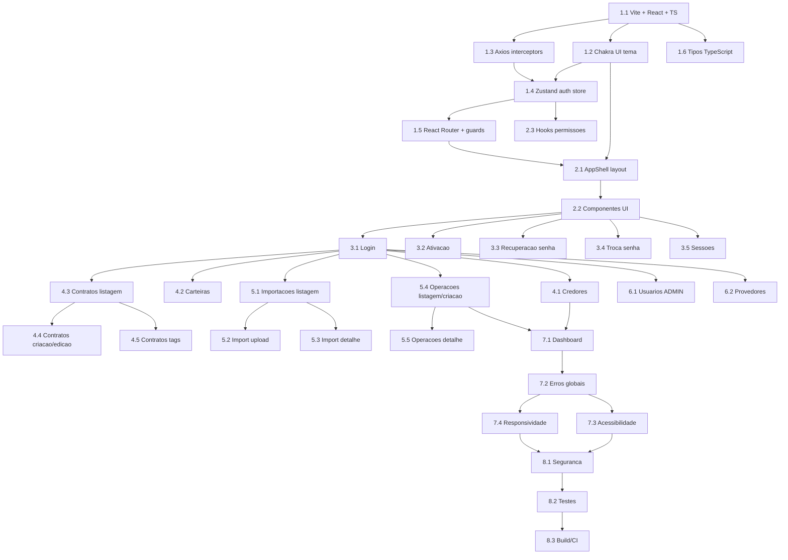

# Implementation Plan:

## Overview

Implementacao completa do CobData Front-end MVP: SPA React + TypeScript + Chakra UI v3 consumindo a API REST do CobData Back-end. Inclui autenticacao JWT, RBAC, CRUD de entidades (credores, carteiras, contratos), importacoes em massa, operacoes Serasa, e painel administrativo. Dividido em 8 fases: scaffold, layout, autenticacao, CRUD core, importacoes/operacoes, admin, polish e seguranca/testes.

## Tasks

- [x] 1. Fase 1: Scaffold e Infraestrutura
  - [x] 1.1 Inicializar projeto Vite + React + TypeScript
    - **Requirements**: R19
    - **Details**: Criar projeto com npm create vite@latest (template react-ts). Configurar tsconfig.json com strict mode e path aliases (@/). Configurar vite.config.ts com proxy para API local e path aliases. Criar .env.example e .env.local com VITE_API_BASE_URL=http://localhost:3000/api. Instalar dependencias core: @chakra-ui/react, @emotion/react, react-router-dom, @tanstack/react-query, axios, zustand, react-hook-form, @hookform/resolvers, zod, react-icons, papaparse. Configurar ESLint + Prettier. Criar .gitignore.
  - [x] 1.2 Configurar Chakra UI v3 com tema customizado
    - **Requirements**: R16, R17
    - **Details**: Criar src/theme/index.ts com createSystem + tokens de cor brand. Criar src/theme/tokens.ts com paleta de cores por status (badges). Criar src/app/providers.tsx com ChakraProvider, QueryClientProvider. Criar src/components/ui/toaster.tsx com createToaster (placement bottom-end). Verificar suporte a dark mode via semantic tokens. Criar src/main.tsx renderizando App com providers.
  - [x] 1.3 Configurar cliente HTTP (Axios) com interceptors
    - **Requirements**: R1, R2, R15, R18, R19
    - **Details**: Criar src/lib/api.ts com instancia Axios (baseURL de env, withCredentials: true, timeout 30s). Implementar request interceptor: adicionar Authorization Bearer e X-Requested-With: XMLHttpRequest. Implementar response interceptor: refresh queue para 401 (conforme design). Criar src/lib/auth.ts com funcoes refreshToken(), processQueue(), variaveis de controle. Criar tratamento generico de erros que mapeia para toast (conforme R15). Incluir tratamento especial para 403 com mensagem Password reset required - redirecionar para /change-password.
  - [x] 1.4 Criar store de autenticacao (Zustand)
    - **Requirements**: R1, R2, R3, R18
    - **Details**: Criar src/stores/authStore.ts com state: accessToken, user, isAuthenticated, mustResetPassword. Implementar actions: setToken (com decodificacao do JWT payload para extrair mustResetPassword), setUser, logout, clear. Token armazenado apenas em memoria (sem persist middleware). Criar hook src/hooks/useAuth.ts que expoe store + utilitarios derivados (role, scopes, isAdmin, etc.). GET /api/auth/me retorna { id, email, name, role, scopes } - usar campo name no UserMenu/Header.
  - [x] 1.5 Configurar React Router com guards de autenticacao e RBAC
    - **Requirements**: R3, R5
    - **Details**: Criar src/app/router.tsx com todas as rotas definidas no design. Criar componente ProtectedRoute (redireciona se nao autenticado). Criar componente RoleGuard (redireciona com toast se role insuficiente). Criar componente MustResetGuard (forca /change-password se mustResetPassword). Implementar lazy loading (React.lazy) para cada feature page. Criar componente PublicRoute (redireciona para dashboard se ja autenticado).
  - [x] 1.6 Criar tipos TypeScript da API
    - **Requirements**: R19
    - **Details**: Criar src/types/enums.ts com Role, DebtType, ProviderStatus, ContractStatus, ImportBatchStatus, OperationAction, OperationStatus, OperationItemStatus, WalletStatus, ProviderType, ProviderEnv, InviteStatus, WebhookStatus, ContactType (EMAIL/PHONE/WHATSAPP), OfferType (DISCOUNT/INSTALLMENT/FULL_PAYMENT). Criar src/types/models.ts com User, Creditor, Wallet, Contract, ImportBatch, ImportBatchError, ProviderOperation, OperationItem, Provider, WalletMapping, Session. Criar src/types/api.ts com PaginatedResponse<T> ({ data: T[], meta: { total, page, limit, totalPages } }), LoginResponse, MeResponse ({ id, email, name, role, scopes }), ApiError ({ statusCode, error, message, requestId, timestamp }), OfferDto ({ type: OfferType, discountPercentage?, installments?, installmentValue?, totalValue?, expiresAt?, notes? }). Criar DTOs de request: CreateCreditorDto, UpdateCreditorDto, CreateWalletDto, UpdateWalletDto, CreateContractDto, UpdateContractDto, InviteUserDto, UpdateUserDto, CreateProviderDto, UpdateProviderDto, CreateWalletMappingDto, CreateOperationDto, UploadImportDto.
- [x] 2. Fase 2: Layout e Componentes Compartilhados
  - [x] 2.1 Criar AppShell (layout principal com Sidebar + Header)
    - **Requirements**: R3, R17
    - **Details**: Criar src/components/layout/AppShell.tsx: Flex com Sidebar (desktop) + Drawer (mobile). Criar src/components/layout/Sidebar.tsx: navegacao com icones, itens condicionais por role. Criar src/components/layout/Header.tsx: logo, breadcrumb (opcional), UserMenu (avatar com name, role, logout, dark mode toggle). Sidebar colapsa em Drawer para telas < lg. Itens de menu: Dashboard, Credores, Carteiras, Contratos, Importacoes, Operacoes, Usuarios (ADMIN), Provedores (ADMIN + OPERATIONAL), Sessoes. VIEWER: ocultar Usuarios e Provedores.
  - [x] 2.2 Criar componentes UI compartilhados
    - **Requirements**: R15, R16, R17
    - **Details**: EmptyState.tsx, ConfirmDialog.tsx (Dialog alertdialog generico), StatusBadge.tsx (Badge colorido por status), DataTable.tsx (wrapper com Table.ScrollArea, stickyHeader, loading skeleton), PaginationBar.tsx (wrapper de Pagination.Root controlado), PageHeader.tsx (titulo + breadcrumb + acoes), LoadingOverlay.tsx, ErrorBoundary.tsx.
  - [x] 2.3 Criar hooks de permissoes e utilitarios
    - **Requirements**: R3, R14, R10
    - **Details**: src/hooks/usePermission.ts (canCreate, canEdit, canDelete baseado em role). src/hooks/usePolling.ts (hook generico com refetchInterval e condicao de parada). src/lib/formatters.ts (formatCurrency BRL, formatCPF, formatCNPJ, formatDate, maskDocument). src/lib/jwt.ts (decodeJwtPayload sem verificacao de assinatura). src/lib/constants.ts (STATUS_COLORS, DEBT_TYPE_LABELS, PROVIDER_STATUS_LABELS, CONTACT_TYPE_LABELS).
- [x] 3. Fase 3: Autenticacao e Gestao de Conta
  - [x] 3.1 Pagina de Login
    - **Requirements**: R1
    - **Details**: Criar src/features/auth/pages/LoginPage.tsx. Formulario com e-mail + senha (React Hook Form + Zod). Validacao inline. Chamar POST /api/auth/login, armazenar token, chamar /auth/me, redirecionar. Tratar 401 (toast generico), 429 (desabilitar botao + contagem regressiva). Acessibilidade: labels, aria-required, focus management. Responsividade: card centralizado, fullscreen em mobile.
  - [x] 3.2 Pagina de Ativacao de Conta
    - **Requirements**: R4
    - **Details**: Criar src/features/auth/pages/ActivatePage.tsx. Extrair token da URL, exibir formulario de nova senha + confirmacao. Indicador de forca/requisitos em tempo real. Chamar POST /api/auth/activate, toast sucesso, redirecionar para login. Tratar 410 (token expirado) com mensagem amigavel.
  - [x] 3.3 Paginas de Recuperacao de Senha
    - **Requirements**: R5
    - **Details**: Criar ForgotPasswordPage.tsx - formulario com e-mail, POST /api/auth/forgot-password, mensagem generica. Criar ResetPasswordPage.tsx - extrair token da URL, formulario de nova senha, POST /api/auth/reset-password. Tratar 410 (token expirado).
  - [x] 3.4 Pagina de Troca de Senha
    - **Requirements**: R5
    - **Details**: Criar ChangePasswordPage.tsx. Formulario com senha atual + nova senha + confirmacao. Validacao de complexidade (Zod). Chamar POST /api/auth/change-password, toast + redirecionar para dashboard. Back-end revoga todas as outras sessoes automaticamente. Usado obrigatoriamente quando mustResetPassword = true (extraido do JWT).
  - [x] 3.5 Pagina de Sessoes Ativas
    - **Requirements**: R6
    - **Details**: Criar SessionsPage.tsx. Listar sessoes (GET /api/auth/sessions) em tabela/cards. Exibir: dispositivo (userAgent), IP (ipAddress), data (createdAt), badge Sessao atual usando campo isCurrent. Botao Revogar por sessao (Dialog confirm) - DELETE /api/auth/sessions/:id. Botao Revogar todas (Dialog confirm) - DELETE /api/auth/sessions. Sessao corrente (isCurrent: true): botao desabilitado com tooltip.
- [x] 4. Fase 4: CRUD de Entidades Core
  - [x] 4.1 Modulo de Credores
    - **Requirements**: R8
    - **Details**: Criar hooks TanStack Query: useCreditorsQuery, useCreditorQuery, useCreateCreditorMutation, useUpdateCreditorMutation, useDeleteCreditorMutation. CreditorsListPage.tsx: tabela paginada + busca + botao criar. CreditorFormDialog.tsx: nome, CNPJ, contatos com tipo ContactType (EMAIL/PHONE/WHATSAPP) + value, endereco (street, number, complement, neighborhood, city, state 2 chars, zipCode 8 digitos). Validacao Zod: nome obrigatorio (1-255), CNPJ 14 digitos + DV, contatos max 10. Botao excluir ADMIN only, tratar 409. Ocultar acoes para VIEWER; ocultar exclusao para OPERATIONAL.
  - [x] 4.2 Modulo de Carteiras
    - **Requirements**: R9
    - **Details**: Criar hooks: useWalletsQuery, useWalletQuery, useCreateWalletMutation, useUpdateWalletMutation, useDeleteWalletMutation. WalletsListPage.tsx: tabela paginada + busca. WalletDetailPage.tsx: dados + resumo agregado (total contratos, por status, soma valores). WalletFormDialog.tsx: nome + credor (select). Criacao via POST /api/creditors/:creditorId/wallets com body { name }. Edicao via PATCH /api/wallets/:id. Validacao: nome 1-120 chars, creditorId obrigatorio. Exclusao ADMIN only, tratar 409.
  - [x] 4.3 Modulo de Contratos - Listagem e Filtros
    - **Requirements**: R10
    - **Details**: Criar hooks: useContractsQuery, useCreateContractMutation, useUpdateContractMutation, useDeleteContractMutation, useTagsQuery, useAddTagsMutation, useRemoveTagsMutation. ContractsListPage.tsx: tabela paginada com filtros (walletId, creditorId, status ContractStatus, providerStatus ProviderStatus, dateFrom/dateTo, debtorDocument, tags). Exibir documento mascarado para VIEWER. Paginacao controlada com PaginationBar. Filtros em HStack/Wrap com selects e inputs.
  - [x] 4.4 Modulo de Contratos - Criacao e Edicao
    - **Requirements**: R10
    - **Details**: ContractFormDialog.tsx. Campos criacao: walletId (select), documento devedor (CPF/CNPJ com DV valido), numero contrato, tipo divida (enum DebtType), data ocorrencia (date picker), valor original, valor atualizado (opcional), origem (opcional). Campos edicao: valor original, valor atualizado, data ocorrencia, tipo divida, walletId (mover contrato), status (ACTIVE/SUSPENDED/CANCELLED), origem, offer (OfferDto com schema formal: type DISCOUNT/INSTALLMENT/FULL_PAYMENT, discountPercentage, installments, installmentValue, totalValue, expiresAt, notes). Validacao Zod completa com validador custom CPF/CNPJ. Edicao desabilitada se providerStatus nao permite (apenas PENDING/FAILED/REMOVED editaveis). Exclusao: ADMIN e OPERATIONAL podem excluir.
  - [x] 4.5 Modulo de Contratos - Tags
    - **Requirements**: R10
    - **Details**: TagsManager.tsx: interface de adicao/remocao de tags com autocomplete. Usar GET /api/contracts/tags para sugestoes. Chipset de tags no detalhe do contrato. POST /api/contracts/:id/tags para adicionar, DELETE /api/contracts/:id/tags para remover. Oculto para VIEWER.
- [x] 5. Fase 5: Importacoes e Operacoes Assincronas
  - [x] 5.1 Modulo de Importacoes - Listagem
    - **Requirements**: R11
    - **Details**: Criar hooks: useImportsQuery, useImportBatchQuery, useImportErrorsQuery, useUploadImportMutation, useConfirmImportMutation, useCancelImportMutation. ImportsListPage.tsx: tabela paginada com filtros (status, wallet). StatusBadge por status do batch. Link para detalhe de cada batch.
  - [x] 5.2 Modulo de Importacoes - Upload (Fase 1)
    - **Requirements**: R11
    - **Details**: ImportUploadPage.tsx. FileUpload.Root com dropzone (aceitar .csv, .xlsx, max 100MB). Select de wallet (obrigatorio). Interface de mapeamento de colunas: ler headers do arquivo (client-side parsing), apresentar select para cada coluna mapeavel com destinos possiveis (debtorDocument, contractNumber, debtType, occurrenceDate, originalValue, updatedValue, debtOrigin). Usar papaparse para parsing client-side dos headers CSV. Resultado e Record<string, string>. Submit multipart POST /api/imports (file + walletId + columnMapping JSON stringified). Tratar 413 (arquivo grande), 422 (formato invalido). Oculto para VIEWER.
  - [x] 5.3 Modulo de Importacoes - Detalhe e Erros (Fase 2)
    - **Requirements**: R11, R14
    - **Details**: ImportDetailPage.tsx. Exibir: status, contadores, wallet, fileName, datas. Polling com refetchInterval (5s) enquanto status intermediario. Progress/Spinner durante VALIDATING e APPLYING. Tabela de erros paginada (GET /api/imports/:batchId/errors, max 50/pagina): linha, campo, codigo, valor mascarado. Botao Confirmar (VALIDATED/VALIDATED_WITH_ERRORS) - Dialog - POST confirm. Botao Cancelar (estados cancelaveis) - Dialog - POST cancel. Toast informativo ao detectar transicao de estado.
  - [x] 5.4 Modulo de Operacoes - Listagem e Criacao
    - **Requirements**: R12
    - **Details**: Criar hooks: useOperationsQuery, useOperationQuery, useCreateOperationMutation, useCancelOperationMutation, useOperationPreviewQuery. OperationsListPage.tsx: tabela paginada com filtros (wallet, status). CreateOperationDialog.tsx: selecionar wallet (com mapeamento ativo) + acao (CREATE_OR_UPDATE/REMOVE). Usar GET /api/operations/preview?walletId=X&action=Y para obter contagem previa de contratos elegiveis ({ walletId, action, eligibleCount, batchCount }) e exibir antes de confirmar criacao. Tratar 422 (nenhum contrato elegivel) com mensagem informativa. Ocultar criar/cancelar para VIEWER.
  - [x] 5.5 Modulo de Operacoes - Detalhe
    - **Requirements**: R12, R14
    - **Details**: OperationDetailPage.tsx. Exibir: status geral, acao, wallet, totalItems, data. Lista de items com status individual (StatusBadge), errorCode/message se falho. Polling (10s) enquanto status PENDING/PROCESSING. Botao Cancelar (PENDING/PROCESSING) - Dialog - POST cancel - tratar 409. Toast ao detectar conclusao.
- [x] 6. Fase 6: Admin - Usuarios e Provedores
  - [x] 6.1 Modulo de Usuarios (ADMIN)
    - **Requirements**: R7
    - **Details**: Criar hooks: useUsersQuery, useInviteUserMutation, useUpdateUserMutation, useResendInviteMutation, useForceResetMutation. UsersListPage.tsx: tabela paginada com status badge e filtro por status (PENDING/ACTIVE/INACTIVE). InviteUserDialog.tsx: e-mail + role + scopes (multi-select de wallets). EditUserDialog.tsx: alterar role, isActive (boolean toggle), scopes. Acoes em menu contextual: Reenviar convite, Forcar reset (com Dialog confirm). Tratar 409 (ultimo ADMIN). Rota protegida: apenas ADMIN.
  - [x] 6.2 Modulo de Provedores (ADMIN + OPERATIONAL leitura)
    - **Requirements**: R13
    - **Details**: Criar hooks: useProvidersQuery, useCreateProviderMutation, useUpdateProviderMutation, useWalletMappingsQuery, useCreateMappingMutation, useDeleteMappingMutation. ProvidersPage.tsx: lista de providers + formulario de criacao/edicao. ProviderFormDialog.tsx: tipo (SERASA_LNOP), ambiente, credenciais (campo password, nunca exibido apos salvar). WalletMappingsPanel.tsx: lista de mappings + criar/excluir. Select de wallet filtra wallets nao mapeadas. Tratar 409 (provedor duplicado, mapping existente). Rota protegida: ADMIN e OPERATIONAL podem visualizar; acoes de escrita restritas a ADMIN. OPERATIONAL: ocultar botoes de escrita, exibir listagem read-only.
- [x] 7. Fase 7: Dashboard e Polish
  - [x] 7.1 Pagina de Dashboard
    - **Requirements**: R3
    - **Details**: DashboardPage.tsx. Exibir cards com metricas resumidas. Atalhos rapidos para acoes frequentes (importar, criar operacao). Adaptado ao role: VIEWER ve apenas dados de suas wallets.
  - [x] 7.2 Tratamento global de erros
    - **Requirements**: R15
    - **Details**: Criar ErrorBoundary global em src/app/App.tsx. Criar pagina 404 para rotas nao encontradas. Validar que todos os cenarios de erro do R15 estao cobertos nos interceptors e mutations. Testar cenarios: offline, 401 em cadeia, 403 em rota direta, 5xx.
  - [x] 7.3 Revisao de acessibilidade
    - **Requirements**: R16
    - **Details**: Auditar contraste de cores (axe-core, Lighthouse). Validar navegacao completa por teclado (Tab, Enter, Escape em Dialogs). Verificar focus ring em todos os componentes interativos. Validar aria-labels em tabelas, formularios, toasts e spinners. Validar role=alertdialog em confirmacoes destrutivas. Testar com screen reader (NVDA/VoiceOver) nos fluxos principais.
  - [x] 7.4 Revisao de responsividade
    - **Requirements**: R17
    - **Details**: Testar todos os fluxos em viewports: 375px (mobile), 768px (tablet), 1280px (desktop). Verificar: sidebar colapsa, tabelas scrollam, dialogs fullscreen em mobile, formularios em grid responsivo. Corrigir overflow/truncamento de textos longos em tabelas.
- [x] 8. Fase 8: Seguranca e Qualidade
  - [x] 8.1 Revisao de seguranca no navegador
    - **Requirements**: R18
    - **Details**: Verificar que accessToken nao esta em localStorage/sessionStorage/cookie JS. Verificar que nenhum uso de dangerouslySetInnerHTML com dados do usuario. Verificar rel=noopener noreferrer em links externos. Verificar source maps desabilitados no build de producao. Verificar que variaveis sensiveis nao estao no bundle. Verificar header X-Requested-With em todas as requisicoes.
  - [x] 8.2 Testes unitarios e de integracao
    - **Requirements**: Qualidade geral
    - **Details**: Configurar Vitest + Testing Library + jsdom. Testes unitarios: authStore, formatters, interceptor de refresh (mock). Testes de componente: LoginPage (submit, validacao, erro), ProtectedRoute (redirect). Testes de integracao: fluxo login -> dashboard -> logout (MSW para mock de API). Meta minima: cobertura de camadas criticas (auth, guards, error handling).
  - [x] 8.3 Build de producao e CI
    - **Requirements**: Operacional
    - **Details**: Configurar script de build (npm run build) com verificacao de types. Configurar lint como pre-commit (opcional: husky + lint-staged). Documentar em README: como rodar local, variaveis de ambiente, build.

## Task Dependency Graph



```json
{
  "waves": [
    {
      "wave": 1,
      "tasks": [1],
      "description": "Project scaffolding and infrastructure setup"
    },
    {
      "wave": 2,
      "tasks": [2],
      "description": "Layout and shared components"
    },
    {
      "wave": 3,
      "tasks": [3],
      "description": "Authentication and account management"
    },
    {
      "wave": 4,
      "tasks": [4],
      "description": "Core entity CRUD (creditors, wallets, contracts)"
    },
    {
      "wave": 5,
      "tasks": [5],
      "description": "Imports and async operations"
    },
    {
      "wave": 6,
      "tasks": [6],
      "description": "Admin modules (users, providers)"
    },
    {
      "wave": 7,
      "tasks": [7],
      "description": "Dashboard and polish (a11y, responsiveness)"
    },
    {
      "wave": 8,
      "tasks": [8],
      "description": "Security review, testing, and CI"
    }
  ]
}
```

## Notes

- Cada tarefa pode ser executada como um commit ou conjunto de commits.
- As fases 4, 5 e 6 podem ser paralelizadas apos a Fase 3.
- Pendencias P4, P7 e P8 do requirements.md foram resolvidas no back-end:
  - P4: Endpoint GET /api/operations/preview disponivel para contagem previa de contratos elegiveis.
  - P7: Campo name adicionado a resposta de GET /api/auth/me.
  - P8: Campo offer possui schema formal OfferDto (type, discountPercentage, installments, installmentValue, totalValue, expiresAt, notes).
- Pendencias P1 (audit-logs) e P9 (tela de auditoria) permanecem postergadas para fase 2.
- O formato de erro da API e { statusCode, error, message, requestId, timestamp }.