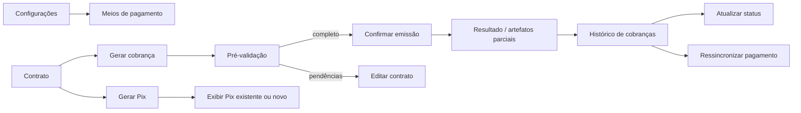
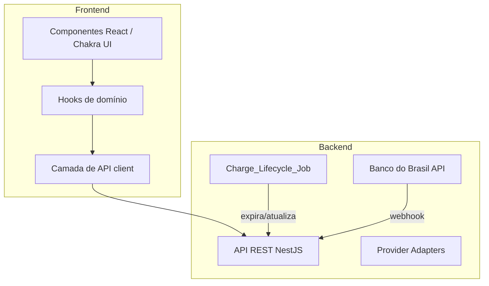
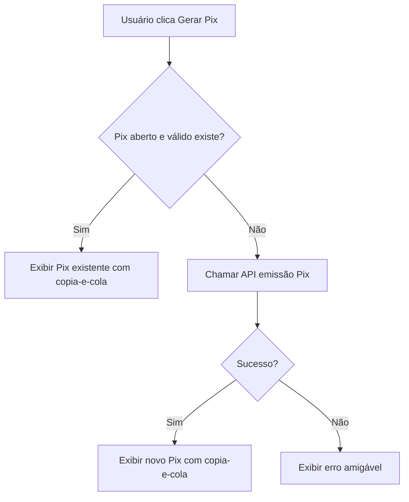
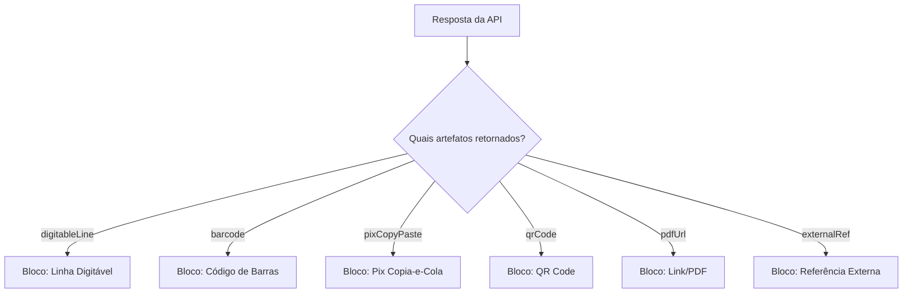
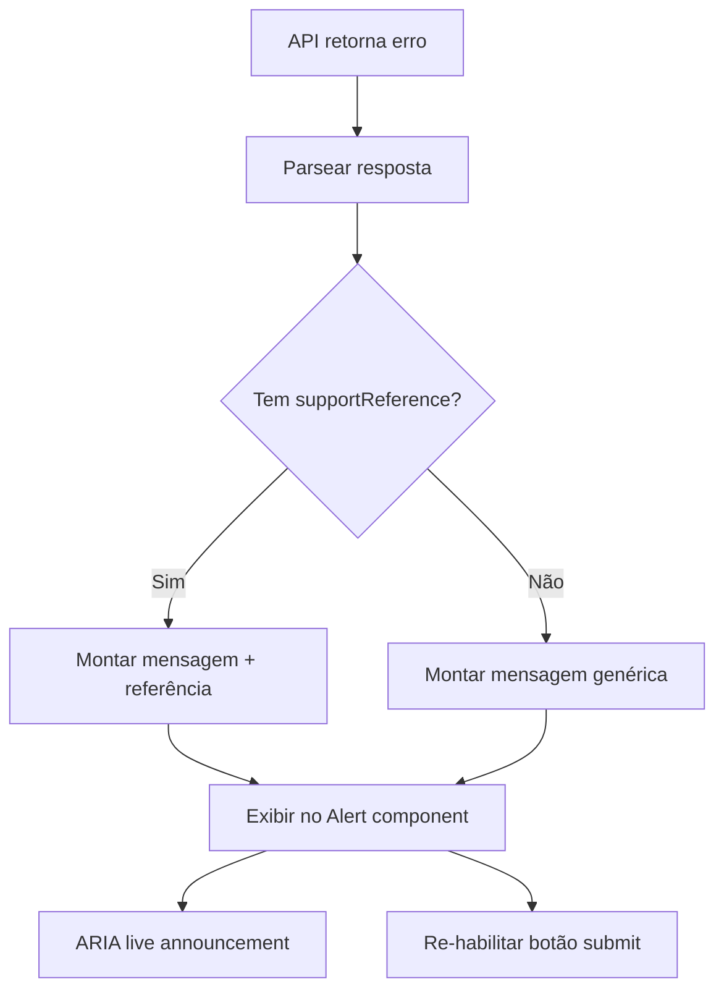
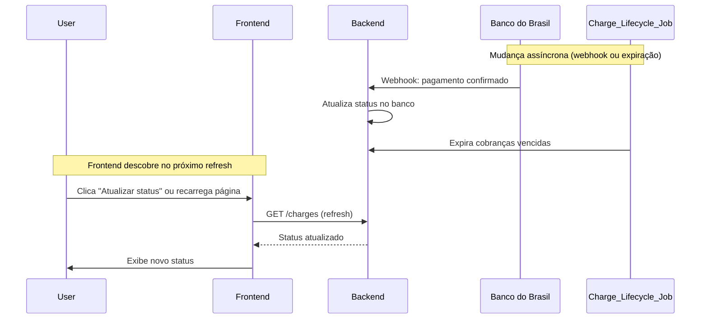

# Design — Interface de Meios de Pagamento Banco do Brasil

## Overview

Este design descreve a camada de frontend para gestão de meios de pagamento e emissão de cobranças integrada ao Banco do Brasil. A interface permite a configuração de gateways, emissão de boletos, Pix e BolePix a partir de contratos, visualização de histórico com atualização manual de status, e tratamento robusto de erros — tudo com controle de permissões e acessibilidade.

O frontend é consumidor puro da API de pagamentos do backend. Não implementa OAuth, certificados, criptografia nem regras específicas do BB; esses pertencem ao backend.

## Architecture



### Camadas de responsabilidade



## Components and Interfaces

### Tela Meios de pagamento

- Lista paginada, com filtros por provedor e estado.
- `PaymentGatewayFormDialog` para criar/editar. Campos secretos usam input de senha e são enviados apenas no submit.
- A edição mostra indicador de credencial configurada, nunca o valor existente.

### Diálogo Gerar cobrança

1. Carrega gateways ativos e suas capacidades.
2. Exibe modalidade, valor e vencimento.
3. Executa `preflight` ao abrir e antes de confirmar.
4. Para pendências, mostra nomes amigáveis dos campos e CTA para editar o contrato.
5. Desabilita confirmação durante o envio. Envia uma chave de idempotência gerada para a tentativa atual.
6. Em sucesso, apresenta `PaymentChargeResult` e atualiza `PaymentChargesList`.

### Ação "Gerar Pix" na listagem de contratos (Req 2 AC9-10)

A listagem de contratos exibe uma ação "Gerar Pix" para usuários ADMIN e OPERATIONAL. O fluxo é:



**Decisões de design:**

- Antes de emitir novo Pix, o frontend consulta a API para verificar se já existe cobrança Pix ativa (status `ACTIVE` ou `PENDING`) para o contrato.
- Se existir Pix válido, o componente `ExistingPixDisplay` renderiza o copia-e-cola e QR Code existentes, com mensagem explicativa: "Já existe um Pix ativo para este contrato".
- Se não existir, o frontend chama a API de emissão e exibe o resultado no componente `PixEmissionResult`.
- A ação usa a mesma lógica de idempotência da emissão de cobrança geral.
- O componente é um popover/dialog leve, diferente do diálogo completo de "Gerar cobrança" que suporta múltiplas modalidades.

**Componentes envolvidos:**

| Componente | Responsabilidade |
|---|---|
| `GeneratePixAction` | Botão na listagem, verifica permissão, orquestra fluxo |
| `ExistingPixDisplay` | Renderiza Pix existente com copia-e-cola e QR Code |
| `PixEmissionResult` | Renderiza Pix recém-emitido |
| `CopyPixCode` | Botão copiar com feedback acessível (ARIA live) |

### Resultado da emissão e resposta parcial do provedor (Req 3 AC2-3)

O componente `PaymentChargeResult` renderiza artefatos de forma condicional e independente. Cada artefato é um bloco que só aparece se presente na resposta da API.



**Decisões de design:**

- **Componentização por artefato**: Cada tipo de artefato é um componente independente (`DigitableLineBlock`, `BarcodeBlock`, `PixCopyPasteBlock`, `QrCodeBlock`, `PdfLinkBlock`, `ExternalRefBlock`).
- **Renderização condicional sem fallback de erro**: Se um campo não está presente na resposta, o bloco correspondente simplesmente não é renderizado. Não há placeholder, skeleton, ou indicador "indisponível".
- **Sem presunção de completude**: O frontend não conhece a priori quais artefatos "deveriam" ter sido retornados. Apenas renderiza o que recebe.
- **BolePix parcial**: Se o backend retorna boleto sem Pix (ex: indisponibilidade temporária do Pix no BB), o resultado mostra apenas o bloco de boleto. O usuário não vê erro nem indicação de que Pix era esperado.

```typescript
// Pseudocódigo do componente
function PaymentChargeResult({ charge }: Props) {
  return (
    <Stack>
      <ChargeStatusBadge status={charge.status} />
      {charge.digitableLine && <DigitableLineBlock value={charge.digitableLine} />}
      {charge.barcode && <BarcodeBlock value={charge.barcode} />}
      {charge.pixCopyPaste && <PixCopyPasteBlock value={charge.pixCopyPaste} />}
      {charge.qrCode && <QrCodeBlock value={charge.qrCode} />}
      {charge.pdfUrl && <PdfLinkBlock url={charge.pdfUrl} />}
      {charge.externalRef && <ExternalRefBlock value={charge.externalRef} />}
    </Stack>
  );
}
```

### Histórico de cobranças — Atualizar status e Ressincronizar (Req 4 AC3, AC6, AC7)

O componente `PaymentChargesList` exibe o histórico de cobranças do contrato com ações de atualização.

#### Botão "Atualizar status" (AC3)

- Botão visível para ADMIN e OPERATIONAL na toolbar do histórico.
- Ao clicar, dispara `GET /contracts/:id/charges?refresh=true` (ou endpoint dedicado de sync).
- Durante a requisição: botão desabilitado com spinner, lista mantém estado atual.
- Ao concluir: lista é atualizada com os novos status retornados pelo backend.
- Não há polling automático; a atualização é exclusivamente manual ou por reload de página (AC5).

#### Pagamento confirmado — valor pago e data efetiva (AC6)

Quando uma cobrança tem status `PAID` ou `SETTLED`, o card de cobrança exibe informações adicionais:

| Campo | Descrição |
|---|---|
| `paidAmount` | Valor efetivamente pago |
| `settlementDate` | Data do settlement (liquidação) |
| `settlementType` | Badge: "Quitação total" ou "Pagamento parcial" |

**Decisão de design:**

- A distinção entre pagamento parcial e quitação total é calculada comparando `paidAmount` com o `chargeAmount` original.
- Badge visual:
  - `paidAmount >= chargeAmount` → verde, "Quitação total"
  - `paidAmount < chargeAmount` → amarelo, "Pagamento parcial"
- Ambos os valores (cobrado e pago) são exibidos para transparência.

```typescript
function SettlementInfo({ charge }: Props) {
  if (!charge.paidAmount || !charge.settlementDate) return null;
  const isFullSettlement = charge.paidAmount >= charge.amount;
  return (
    <HStack>
      <Badge colorPalette={isFullSettlement ? 'green' : 'yellow'}>
        {isFullSettlement ? 'Quitação total' : 'Pagamento parcial'}
      </Badge>
      <Text>Pago: {formatCurrency(charge.paidAmount)}</Text>
      <Text>em {formatDate(charge.settlementDate)}</Text>
    </HStack>
  );
}
```

#### Ação "Ressincronizar pagamento" (AC7)

- Visível apenas para **usuários internos autorizados** (verificação via permissão específica, ex: `charge:resync`).
- Ação disponível por cobrança individual (menu de ações do card/row).
- Ao clicar: chama `POST /charges/:chargeId/resync` que consulta o status diretamente no BB.
- Feedback: toast de sucesso/erro + atualização do status inline no card.
- Diferença para "Atualizar status": este busca em batch para todas as cobranças; "Ressincronizar" consulta individualmente direto no provedor.

### Tipos da API

`PaymentGatewaySummary`, `PaymentMethod`, `PaymentChargeStatus`, `PaymentCharge`, `PaymentPreflightResult` e `CreatePaymentChargeInput` ficam no módulo de pagamentos, não no módulo de contratos, para permitir reuso por outros fluxos.

Tipos adicionados:

```typescript
interface PaymentCharge {
  id: string;
  contractId: string;
  method: PaymentMethod;
  amount: number;
  dueDate: string;
  status: PaymentChargeStatus;
  createdAt: string;
  externalRef?: string;
  // Artefatos condicionais
  digitableLine?: string;
  barcode?: string;
  pixCopyPaste?: string;
  qrCode?: string;
  pdfUrl?: string;
  // Settlement (Req 4 AC6)
  paidAmount?: number;
  settlementDate?: string;
}

type SettlementType = 'full' | 'partial';
```

## Data Models

### Estado do componente Gerar Pix

```typescript
interface GeneratePixState {
  loading: boolean;
  existingPix: PaymentCharge | null; // Pix ativo existente
  newPix: PaymentCharge | null;      // Pix recém-emitido
  error: UserFriendlyError | null;
}
```

### Estado do histórico de cobranças

```typescript
interface ChargeHistoryState {
  charges: PaymentCharge[];
  loading: boolean;
  refreshing: boolean;        // "Atualizar status" em andamento
  resyncingId: string | null; // ID da cobrança sendo ressincronizada
}
```

### Modelo de erro amigável (Req 5)

```typescript
interface UserFriendlyError {
  message: string;            // Mensagem não-técnica para o usuário
  supportReference?: string;  // Identificador de suporte quando disponível
}
```

## Estados e feedback

- **Loading**: skeleton para lista/histórico e botão com estado de envio.
- **Empty**: mensagem objetiva quando o contrato ainda não tem cobranças.
- **Validation**: campos pendentes agrupados, sem erro técnico do banco.
- **Provider error**: mensagem tratada, identificador de suporte quando disponível, sem corpo HTTP bruto.
- **Accessibility**: diálogo com foco inicial, labels explícitas, anúncios de cópia/sucesso e botões com nomes acessíveis.

### Comportamento após erro na emissão (Req 5 — detalhamento)

Quando a API de emissão retorna erro, o fluxo de UX segue:



**Regras detalhadas:**

1. **Mensagem não-técnica**: O frontend mantém um mapa de códigos de erro para mensagens amigáveis em português. Erros desconhecidos recebem mensagem genérica: "Não foi possível emitir a cobrança. Tente novamente ou entre em contato com o suporte."
2. **Botão reabilitado para retry**: Imediatamente após exibir o erro, o botão de submissão volta ao estado habilitado. Uma nova `Idempotency_Key` é gerada para a próxima tentativa.
3. **ARIA announcement**: O container de erro usa `role="alert"` e `aria-live="assertive"` para que screen readers anunciem o erro automaticamente sem necessidade de foco manual.
4. **Referência de suporte**: Quando `supportReference` está presente na resposta de erro, é exibida no formato: "Referência para suporte: {id}". A referência é copiável.
5. **Sem dados técnicos**: Nenhum HTTP status code, stack trace, corpo JSON do provedor ou identificador interno é exibido. O mapa de erros faz a tradução.

```typescript
// Componente de erro
function ChargeErrorFeedback({ error }: { error: UserFriendlyError }) {
  return (
    <Alert.Root status="error" role="alert" aria-live="assertive">
      <Alert.Icon />
      <Alert.Content>
        <Alert.Title>Erro na emissão</Alert.Title>
        <Alert.Description>{error.message}</Alert.Description>
        {error.supportReference && (
          <Text fontSize="sm" mt={2}>
            Referência para suporte: <Code>{error.supportReference}</Code>
          </Text>
        )}
      </Alert.Content>
    </Alert.Root>
  );
}
```

## Atualização assíncrona de status — Charge_Lifecycle_Job (decisão arquitetural)

O backend executa um job assíncrono (`Charge_Lifecycle_Job`) responsável por:

- Expirar cobranças vencidas (mover para status `EXPIRED`).
- Processar webhooks do Banco do Brasil que atualizam status (ex: `PAID`, `CANCELLED`).

**Impacto no frontend:**

O status de uma cobrança pode mudar a qualquer momento no backend (via job de expiração ou webhook do BB), sem que o frontend seja notificado em tempo real.



**Decisões de design:**

| Decisão | Justificativa |
|---|---|
| Sem WebSocket/SSE nesta entrega | Complexidade desnecessária para o volume atual; refresh manual é suficiente |
| Frontend não faz polling automático | Evita carga desnecessária no backend; usuário controla quando atualizar |
| Status pode estar "stale" até refresh | Documentado como comportamento esperado; não é bug |
| Botão "Atualizar status" é a solução | UX clara e previsível para o operador |
| "Ressincronizar" consulta o BB diretamente | Para casos onde o webhook pode ter falhado; ação de último recurso para usuários internos |

**Implicações de UX:**

- O histórico exibido pode não refletir o status mais recente até que o usuário clique "Atualizar status" ou recarregue a página.
- Não há indicador de "dados possivelmente desatualizados" — isso geraria ansiedade desnecessária. O fluxo natural do operador é atualizar antes de tomar decisões.
- Ao abrir o histórico (mount), o frontend faz fetch automático, garantindo dados frescos na abertura.

## Limites

- O front não implementa OAuth, certificados, criptografia nem regras específicas do BB; esses pertencem ao backend.
- A modalidade disponível vem da capacidade declarada pelo gateway, e não de uma lista fixa no componente.
- O frontend não tem conhecimento de quais artefatos "deveriam" ter sido retornados em BolePix; renderiza apenas o que recebe.
- O frontend não faz real-time push; depende de refresh manual para descobrir mudanças assíncronas de status.

## Correctness Properties

*A property is a characteristic or behavior that should hold true across all valid executions of a system — essentially, a formal statement about what the system should do. Properties serve as the bridge between human-readable specifications and machine-verifiable correctness guarantees.*

### Property 1: Credentials never leak to UI

*For any* Payment_Gateway data object containing credential fields (tokens, secrets, certificates), rendering any view (list, detail, form) SHALL never include the credential values in the rendered output.

**Validates: Requirements 1.3, 6.4**

### Property 2: Role-based action visibility

*For any* user with a given role, the UI SHALL display only the actions permitted for that role, and unauthorized actions SHALL be absent from the DOM (not merely disabled).

**Validates: Requirements 2.1, 6.1, 6.2**

### Property 3: Preflight validation disables submission

*For any* Preflight_Validation result containing one or more issues, the submission button SHALL be disabled and each issue SHALL be displayed with a user-friendly field name.

**Validates: Requirements 2.4, 2.5**

### Property 4: Idempotency key uniqueness

*For any* sequence of charge submission attempts from the same dialog session, each attempt SHALL generate a distinct Idempotency_Key with no collisions.

**Validates: Requirements 2.8**

### Property 5: Existing Pix takes precedence over new emission

*For any* contract that has an active Pix (status ACTIVE or PENDING), the "Gerar Pix" action SHALL display the existing Pix copy-and-paste code instead of triggering a new emission.

**Validates: Requirements 2.10**

### Property 6: Conditional artifact rendering

*For any* charge result response, only the artifacts present in the response SHALL be rendered; artifacts not included in the response SHALL have no corresponding DOM element, error indicator, or placeholder.

**Validates: Requirements 3.1, 3.2, 3.3**

### Property 7: Charge history ordering

*For any* list of charges displayed in the history, the entries SHALL be ordered by creation date in descending order (most recent first).

**Validates: Requirements 4.2**

### Property 8: Settlement display accuracy

*For any* confirmed payment, the UI SHALL display the paid amount and settlement date, and SHALL correctly classify as "Quitação total" when paidAmount >= chargeAmount, or "Pagamento parcial" when paidAmount < chargeAmount.

**Validates: Requirements 4.6**

### Property 9: Error messages are non-technical

*For any* error response from the charge issuance API, the displayed message SHALL not contain HTTP status codes, stack traces, raw JSON payloads, or internal identifiers; and the submission button SHALL be re-enabled after the error is shown.

**Validates: Requirements 5.1, 5.2, 5.3**

### Property 10: Error accessibility announcement

*For any* error state displayed after charge emission failure, the error container SHALL have `role="alert"` and `aria-live="assertive"` attributes to ensure screen reader announcement.

**Validates: Requirements 5.4**

### Property 11: Support reference conditional inclusion

*For any* error response containing a `supportReference` field, the rendered error message SHALL include that reference; for responses without it, no reference placeholder SHALL appear.

**Validates: Requirements 5.5**

## Error Handling

| Cenário | Tratamento no frontend |
|---|---|
| Falha na emissão (4xx/5xx) | Mensagem amigável via mapa de erros, botão reabilitado, ARIA alert, referência de suporte se disponível |
| Preflight com pendências | Campos destacados com nomes amigáveis, CTA para editar contrato, botão submit desabilitado |
| HTTP 403 (sem permissão) | Mensagem de acesso negado, remoção da ação da interface |
| Timeout/rede | Mensagem genérica "Verifique sua conexão", botão retry habilitado |
| Resposta parcial BolePix | Renderiza apenas artefatos presentes, sem indicação de erro para os ausentes |
| Pix duplicado (tentativa de emitir com Pix ativo) | Exibe Pix existente, não emite novo |
| Ressincronizar falha | Toast de erro com mensagem amigável |

## Testing Strategy

### Testes unitários (example-based)

- Renderização de componentes com dados mock (lista de gateways, charge result, histórico).
- Interações de UI: abrir dialog, clicar copiar, submit com loading.
- Visibilidade por role: ADMIN vê tudo, OPERATIONAL vê emissão, VIEWER só histórico.
- Comportamento após 403: mensagem + remoção de ação.
- "Gerar Pix" com Pix existente: exibe existente.
- "Atualizar status" e "Ressincronizar": verifica chamadas de API e atualização de UI.

### Testes de propriedade (property-based)

Biblioteca: **fast-check** (TypeScript)
Configuração: mínimo 100 iterações por propriedade.

| Property | Tag |
|---|---|
| Credentials never leak | Feature: payment-methods-banco-do-brasil, Property 1: Credentials never leak to UI |
| Role-based visibility | Feature: payment-methods-banco-do-brasil, Property 2: Role-based action visibility |
| Preflight disables submit | Feature: payment-methods-banco-do-brasil, Property 3: Preflight validation disables submission |
| Idempotency key uniqueness | Feature: payment-methods-banco-do-brasil, Property 4: Idempotency key uniqueness |
| Existing Pix precedence | Feature: payment-methods-banco-do-brasil, Property 5: Existing Pix takes precedence |
| Conditional artifact rendering | Feature: payment-methods-banco-do-brasil, Property 6: Conditional artifact rendering |
| Charge history ordering | Feature: payment-methods-banco-do-brasil, Property 7: Charge history ordering |
| Settlement display accuracy | Feature: payment-methods-banco-do-brasil, Property 8: Settlement display accuracy |
| Error messages non-technical | Feature: payment-methods-banco-do-brasil, Property 9: Error messages are non-technical |
| Error accessibility | Feature: payment-methods-banco-do-brasil, Property 10: Error accessibility announcement |
| Support reference inclusion | Feature: payment-methods-banco-do-brasil, Property 11: Support reference conditional inclusion |

### Testes de integração

- Fluxo completo de emissão de cobrança (mock de API).
- Fluxo "Gerar Pix" verificando checagem de Pix existente.
- Refresh de histórico com dados atualizados.
- Ressincronização individual com mock de resposta do backend.
